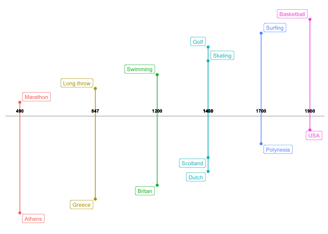
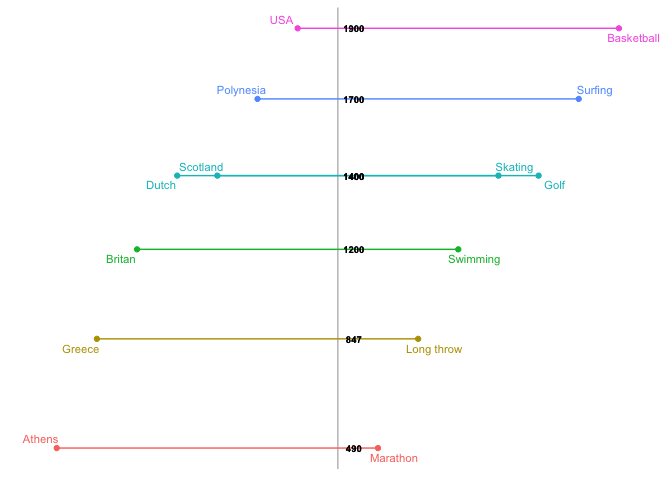

timelineR
=========

### Historical events visualisation in chronological order

<!-- badges: start -->
[](https://www.tidyverse.org/lifecycle/#experimental) <!-- badges: end -->

Sample data to view events chronologically

``` r

tidy_df <- tibble::tibble(year=c(490,847, 1200,1400, 1400, 1700, 1900), event=c( "Marathon","Long throw", "Swimming","Skating","Golf","Surfing","Basketball" ), person=c("Athens", "Greece", "Britan", "Dutch", "Scotland","Polynesia", "USA" ))

knitr::kable(tidy_df)
```

|  year| event      | person    |
|-----:|:-----------|:----------|
|   490| Marathon   | Athens    |
|   847| Long throw | Greece    |
|  1200| Swimming   | Britan    |
|  1400| Skating    | Dutch     |
|  1400| Golf       | Scotland  |
|  1700| Surfing    | Polynesia |
|  1900| Basketball | USA       |

> This is a dummy data, generated only for visualisation purpose

#### Horizontal timeline

Two features associated with each time-point can be plotted. For instance, the sport first known and the country of origin. 1. Timeline is plotted horizontally

``` r
source("R/chronological_timeline.R")
source("R/timeline_theme.R")
chronological_timeline(tidy_df=tidy_df,text = FALSE,horizontal = TRUE)
```



#### Vertical timeline

1.  Timeline is plotted vertically

``` r
source("R/chronological_timeline.R")
source("R/timeline_theme.R")
chronological_timeline(tidy_df=tidy_df,text = TRUE,horizontal = FALSE)
```


